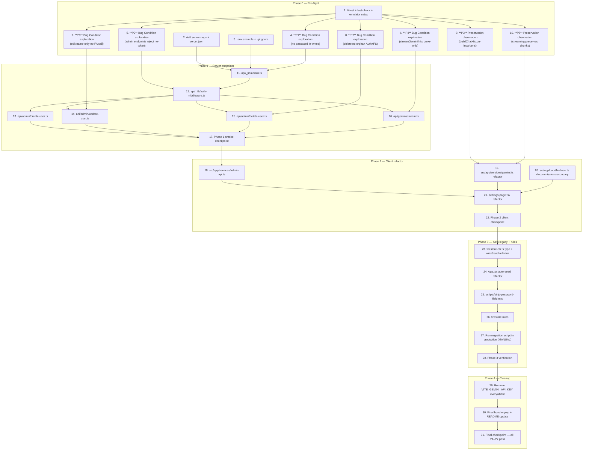

# Implementation Plan

Tasks below are organized to follow the **4-phase Roll-out Plan** in `design.md`
sehingga aplikasi tidak pernah dalam keadaan broken di antara dua deploy:

- **Phase 0 — Pre-flight.** Setup tooling, env vars, dependencies, dan **tulis
  semua property test (P1–P7) di atas kode unfixed**. Exploration tests harus
  FAIL (membuktikan bug exist); preservation tests harus PASS (capture baseline).
- **Phase 1 — Server endpoints.** Tambah `api/_lib/*` dan `api/admin/*` +
  `api/gemini/stream` tanpa menyentuh client. Endpoint live tapi belum dipanggil.
- **Phase 2 — Client refactor.** Pindahkan admin ops & Gemini ke endpoint baru,
  hapus `secondaryAuth`, hapus kolom Password di UI.
- **Phase 3 — Strip legacy.** Refactor `firestore-db.ts`, auto-seed di `App.tsx`,
  jalankan migration script, deploy `firestore.rules`.
- **Phase 4 — Cleanup.** Hapus `VITE_GEMINI_API_KEY`, regrep bundle, update
  dokumentasi.

**Conventions:**
- Property tasks pakai format `**Property N: Type** - [Title]` agar kompatibel
  dengan hover status. N (1–7) konsisten dengan PBT IDs di `design.md → Testing
  Strategy → Property-Based Tests`.
- Setiap implementation task mencantumkan: `_Bug_Condition_`, `_Expected_Behavior_`,
  `_Preservation_`, `_Requirements_`, `_Property_`, `_Files_`, `_Verify_`,
  `_Effort_` (XS/S/M/L).
- `_Effort_` rough estimate: XS = <30min, S = 30–90min, M = 0.5–1 day, L = 1–2 days.
- Phase 0 menulis tests **sebelum** ada production code apa pun yang berubah,
  sesuai bugfix methodology (observation-first untuk preservation, fail-first
  untuk bug condition).

## Task Dependency Graph




---

## Phase 0 — Pre-flight (Setup + Tests on UNFIXED code)

> Tujuan: dependency, env contract, dan test harness siap; **semua property
> test ditulis di atas kode unfixed**. Bug Condition tests (P1, P2, P4, P6, P7)
> harus FAIL — itu yang membuktikan bug ada. Preservation tests (P3, P5) harus
> PASS — itu yang membuktikan baseline behavior tertangkap. Tidak ada production
> code yang berubah di phase ini.

- [ ] 1. Setup test harness (Vitest + fast-check + Firebase emulator + Testing Library)
  - Tambah devDependencies: `vitest`, `@vitest/coverage-v8`, `fast-check`,
    `@testing-library/react`, `@testing-library/jest-dom`, `jsdom`,
    `firebase-tools`
  - Tambah `vitest.config.ts` (environment: jsdom untuk client tests; node
    untuk `api/**` tests via project config)
  - Tambah `vitest.setup.ts` yang men-set `FIREBASE_AUTH_EMULATOR_HOST=localhost:9099`
    & `FIRESTORE_EMULATOR_HOST=localhost:8080` saat env `USE_FIREBASE_EMULATOR=1`
  - Tambah script `"test": "vitest --run"` & `"test:watch": "vitest"` ke `package.json`
  - Tambah `firebase.json` minimal config (emulators: auth port 9099, firestore port 8080)
  - Verify: `npm run test --run` exits 0 dengan dummy `tests/smoke.test.ts`
  - _Files: `package.json`, `vitest.config.ts`, `vitest.setup.ts`, `firebase.json`, `tests/smoke.test.ts`_
  - _Verify: `npm run test --run` ✅; `firebase emulators:start --only auth,firestore` boots clean_
  - _Effort: M_

- [ ] 2. Add server-side dependencies + vercel.json
  - Tambah `firebase-admin` ke `dependencies`
  - Tambah `@vercel/node` ke `devDependencies` (untuk type `VercelRequest`/`VercelResponse`)
  - Tambah scripts: `"dev:vercel": "vercel dev"`, `"strip-passwords": "node scripts/strip-password-field.mjs"`
  - Buat `vercel.json` per design File 18 (Node.js 20.x runtime untuk `api/admin/*.ts` & `api/gemini/stream.ts`)
  - Verify: `npm install` succeed; `vercel dev --help` accessible (after `npm i -g vercel` jika perlu)
  - _Requirements: 2.7, 2.8, 2.12, 2.13_
  - _Files: `package.json`, `vercel.json`_
  - _Verify: `npm install` exits 0; `cat vercel.json | jq .functions` matches design_
  - _Effort: S_

- [ ] 3. Update `.env.example` + `.gitignore`
  - Replace `.env.example` dengan template di design File 16 (kelompok Firebase
    Web SDK / Admin SDK / Gemini)
  - Comment `VITE_GEMINI_API_KEY` sebagai DEPRECATED (tetap dokumentasi sampai Phase 4)
  - Tambah `service-account.json` & `.env.local` ke `.gitignore`
  - Tambah `.firebase/` ke `.gitignore`
  - Verify: `git check-ignore service-account.json` returns 0
  - _Requirements: 2.11, 2.12_
  - _Files: `.env.example`, `.gitignore`_
  - _Verify: `grep -E '^(GEMINI_API_KEY|FIREBASE_ADMIN_)' .env.example` returns 4 lines; `git check-ignore` ok_
  - _Effort: XS_

- [ ] 4. Write Bug Condition exploration test for password leakage
  - **Property 1: Bug Condition** - No `password` field in Firestore user writes
  - **CRITICAL**: This test MUST FAIL on unfixed code — failure confirms Bug 1 exists
  - **DO NOT attempt to fix the test or the code when it fails**
  - **GOAL**: Surface counterexamples bahwa `saveUser`, auto-seed `App.tsx`, dan
    `migrateFromLocalStorage` menulis field `password` ke Firestore
  - **Scoped PBT Approach**: Property over `fc.record({id, name, email, password: fc.option(fc.string()), extraField: fc.anything()})`
    — assert tidak ada `password` key di setDoc payload
  - Setup: connect ke Firestore Emulator, mock/spy `setDoc` & `writeBatch.set`
    untuk capture payloads
  - Test cases:
    - `saveUser({id, name, email, password})` → assert no `password` in observed write
    - Auto-seed di `App.tsx` (simulate first-login firebaseUser) → assert no `password`
    - `migrateFromLocalStorage` dengan stored user yang punya password → assert no `password`
  - **Bug Condition (from design):** `c1 := input.kind ∈ {saveUser, autoSeedProfile, migrateLocalStorage} AND "password" ∈ keys(input.firestorePayload)`
  - **Expected Behavior (from design):** payload Firestore hanya `{id, name, email}`
  - Run pada UNFIXED code
  - **EXPECTED OUTCOME**: Test FAILS dengan counterexample concrete (mis. `{password: "admin1234"}` muncul di payload auto-seed)
  - Document counterexamples di test output (`fc.assert` shrinks)
  - _Requirements: 1.1, 1.4, 1.5, 2.1, 2.2, 2.4, 2.5_
  - _Files: `tests/properties/p1-no-password.test.ts`_
  - _Verify: `npx vitest --run tests/properties/p1-no-password.test.ts` exits non-zero with `fc.assert` counterexample logged_
  - _Effort: M_

- [ ] 5. Write Bug Condition exploration test for unauthenticated admin endpoints
  - **Property 2: Bug Condition** - Admin endpoints MUST reject requests without valid ID token
  - **CRITICAL**: Pada Phase 0 endpoint belum ada — tulis test sebagai skeleton
    yang memanggil **future handler** via dynamic import. Test akan FAIL karena
    file tidak ada, **itu juga counterexample valid**: bug exists karena tidak
    ada server-side enforcement sama sekali.
  - **DO NOT attempt to fix the test by mocking the handler**
  - **GOAL**: Membuktikan bahwa saat ini admin ops dijalankan client-side tanpa
    ID token verification (no `/api/admin/*` exists)
  - **Scoped PBT Approach**: Property over arbitrary headers yang TIDAK match
    `^Bearer\s+\S+/i` → invoke handler → assert `status === 401` AND
    `adminAuth().verifyIdToken` never called
  - Test cases (skeleton):
    - Header missing → 401
    - Header `Bearer` (no token) → 401
    - Header `Bearer invalid.jwt.token` → 401
    - Header `Token abc123` (wrong scheme) → 401
  - **Bug Condition (from design):** `c2 := input.kind ∈ {editUser, deleteUser} AND input.path == "client-side"`
  - **Expected Behavior (from design):** server-side endpoint memverifikasi ID token sebelum invoke Admin SDK; tanpa token → 401
  - Run pada UNFIXED code
  - **EXPECTED OUTCOME**: Test FAILS (file `api/admin/create-user.ts` belum ada → import error → counterexample: "tidak ada server boundary")
  - Document hasil di test report
  - _Requirements: 1.6, 1.7, 1.8, 2.7, 2.8, 2.9, 2.10_
  - _Files: `tests/properties/p2-admin-auth.test.ts`_
  - _Verify: `npx vitest --run tests/properties/p2-admin-auth.test.ts` exits non-zero (module not found)_
  - _Effort: S_

- [ ] 6. Write Bug Condition exploration test for direct Gemini browser calls
  - **Property 4: Bug Condition** - `streamGemini` & `askGemini` SHALL hit `/api/gemini/*` only, never `generativelanguage.googleapis.com`
  - **CRITICAL**: This test MUST FAIL on unfixed code — current `gemini.ts`
    memanggil googleapis.com langsung via `@google/generative-ai` SDK
  - **DO NOT attempt to fix the test or the code when it fails**
  - **GOAL**: Surface bahwa kode client masih panggil `generativelanguage.googleapis.com`
  - **Scoped PBT Approach**: Property over `fc.record({userMessage, features:fc.array(featureArb), types, trainingEntries:fc.array(trainingArb), mode:fc.constantFrom("qa","draft","report","summarize"), chatHistory:fc.array(chatArb)})`
    — capture all `fetch`/XHR URLs → assert all start with `/api/gemini` AND none contain `googleapis.com`
  - Setup: monkey-patch `global.fetch` & intercept fetch made by SDK; alternative
    instrument network via msw
  - Test cases:
    - Call `streamGemini` dengan minimal payload → log all URLs hit
  - **Bug Condition (from design):** `c3 := input.kind ∈ {streamGemini, askGemini} AND input.runtime == "browser" AND (input.targetHost == "generativelanguage.googleapis.com" OR input.apiKeySource == "VITE_GEMINI_API_KEY")`
  - **Expected Behavior (from design):** semua request menuju `/api/gemini` proxy server-side
  - Run pada UNFIXED code
  - **EXPECTED OUTCOME**: Test FAILS dengan counterexample URL `https://generativelanguage.googleapis.com/v1beta/models/gemini-3.1-flash-lite:streamGenerateContent?...`
  - Document counterexample
  - _Requirements: 1.10, 1.11, 1.12, 2.11, 2.12, 2.13, 2.14, 2.15_
  - _Files: `tests/properties/p4-gemini-proxy.test.ts`_
  - _Verify: `npx vitest --run tests/properties/p4-gemini-proxy.test.ts` exits non-zero with `googleapis.com` in counterexample_
  - _Effort: M_

- [ ] 7. Write Bug Condition exploration test for edit-name-only re-auth
  - **Property 6: Bug Condition** - Edit name-only SHALL NOT call Firebase Auth email/password update
  - **CRITICAL**: This test MUST FAIL on unfixed code — current `handleEdit`
    selalu memanggil `signInWithEmailAndPassword(secondaryAuth, ...)` walau
    hanya name yang berubah
  - **DO NOT attempt to fix the test or the code when it fails**
  - **GOAL**: Surface bahwa edit name-only memicu re-auth flow yang rapuh
  - **Scoped PBT Approach**: Property over `fc.record({uid:fc.uuid(), name:fc.string({minLength:1}), origUser:fc.record({email:fc.emailAddress(), name:fc.string(), password:fc.string()})})`
    — setup state dengan email & password TIDAK berubah → spy semua call ke
    `signInWithEmailAndPassword` & `updatePassword` & `updateEmail` → assert
    spy.callCount === 0
  - **Concrete failing case (deterministic)**: `origUser.password === "admin1234"`
    (Firestore plaintext) tapi Firebase Auth password sebenarnya `"realPwd"` →
    edit name-only akan trigger sign-in error
  - Test render `SettingsPage` via `@testing-library/react`, simulate Edit form
    submission dengan name change saja
  - **Bug Condition (from design):** `c2` dengan `usesSecondaryAuthSignIn == true`
  - **Expected Behavior (from design):** edit name-only hanya update Firestore field `name`, no FA call
  - Run pada UNFIXED code
  - **EXPECTED OUTCOME**: Test FAILS — counterexample: spy `signInWithEmailAndPassword.calledOnce === true` walau hanya name berubah; OR sign-in throws `auth/wrong-password`
  - Document counterexample
  - _Requirements: 1.6, 1.7, 2.7, 3.3_
  - _Files: `tests/properties/p6-edit-name-only.test.ts`_
  - _Verify: `npx vitest --run tests/properties/p6-edit-name-only.test.ts` exits non-zero with FA call count > 0_
  - _Effort: M_

- [ ] 8. Write Bug Condition exploration test for delete orphan-Auth invariant
  - **Property 7: Bug Condition** - Delete operation NEVER leaves state `(Auth=alive, Firestore=deleted)`
  - **CRITICAL**: This test MUST FAIL on unfixed code — current `confirmDelete`
    pada sign-in fail hanya `console.warn` lalu tetap memanggil `deleteUserProfile`,
    menghasilkan orphan Auth user
  - **DO NOT attempt to fix the test or the code when it fails**
  - **GOAL**: Surface orphan-Auth bug
  - **Scoped PBT Approach**: Failure injection property over `fc.record({failFA:fc.boolean(), failFS:fc.boolean(), uid:fc.uuid()})`
    — setup emulator state, inject failures, run delete flow, assert
    `!(faAlive && fsDeleted)` (forbidden combination)
  - **Concrete failing case (deterministic)**: setup user dengan Firestore
    password mismatch → `failFA=true via wrong-password` → run `confirmDelete` →
    expect orphan
  - Setup: Firebase Auth Emulator + Firestore Emulator + spy `deleteUser`/`deleteUserProfile`
  - **Bug Condition (from design):** `c2` dengan `requiresPlaintextPassword == true` AND delete flow
  - **Expected Behavior (from design):** Auth-first ordering; jika Auth fail → 0 perubahan; jika Auth ok + Firestore fail → 500 `PARTIAL_DELETE_AUTH_GONE` tapi NEVER `(Auth=alive, FS=deleted)`
  - Run pada UNFIXED code
  - **EXPECTED OUTCOME**: Test FAILS — counterexample: state `Auth=alive, Firestore=deleted` muncul
  - Document counterexample
  - _Requirements: 1.8, 2.8, 2.9_
  - _Files: `tests/properties/p7-delete-no-orphan.test.ts`_
  - _Verify: `npx vitest --run tests/properties/p7-delete-no-orphan.test.ts` exits non-zero with orphan-Auth counterexample_
  - _Effort: L_

- [ ] 9. Write Preservation observation test for `buildChatHistory` invariants
  - **Property 3: Preservation** - `buildChatHistory` invariants tetap dipertahankan setelah refactor
  - **IMPORTANT**: Follow observation-first methodology — observe behavior pada UNFIXED `buildChatHistory` dengan random inputs, capture invariants, assert pada UNFIXED code → test PASSES (baseline)
  - Property over `fc.array(fc.record({id:fc.string(), role:fc.constantFrom("user","assistant"), content:fc.string(), timestamp:fc.date()}))`
  - Invariants (from design):
    - (a) jika output non-empty, `out[0].role === "user"`
    - (b) tidak ada entry dengan `parts[0].text.trim() === ""` atau `=== "..."`
    - (c) order preserved relative ke input
    - (d) `out.length <= history.length`
  - Run tests on UNFIXED code
  - **EXPECTED OUTCOME**: Tests PASS (confirms baseline behavior to preserve)
  - **Preservation guarantee**: After Phase 2 refactor, `buildChatHistory`
    function MUST remain unchanged (verify same test still passes)
  - _Requirements: 3.7_
  - _Files: `tests/properties/p3-build-chat-history.test.ts`_
  - _Verify: `npx vitest --run tests/properties/p3-build-chat-history.test.ts` exits 0_
  - _Effort: S_

- [ ] 10. Write Preservation observation test for streaming chunk content
  - **Property 5: Preservation** - Streaming end-to-end SHALL preserve concatenated chunk content
  - **IMPORTANT**: Follow observation-first methodology — observe behavior pada
    UNFIXED `streamGemini` dengan mocked SDK upstream → capture invariant: yielded
    chunks concatenated equals upstream chunks concatenated
  - Property over `fc.array(fc.string(), {minLength:1, maxLength:20})` (chunk
    payloads)
  - Setup: mock `@google/generative-ai` SDK to yield chunks deterministically
    (mockGoogleSdk pattern di design)
  - Assert: `collected.join("") === chunks.join("")`
  - Run tests on UNFIXED code
  - **EXPECTED OUTCOME**: Tests PASS pada UNFIXED code (confirms baseline streaming semantics)
  - **Preservation guarantee**: Setelah Phase 2 refactor (gemini.ts → fetch
    wrapper), test yang sama dengan harness mock di SSE layer (mockSseResponse)
    HARUS tetap pass
  - _Requirements: 2.15, 3.6, 3.7_
  - _Files: `tests/properties/p5-streaming-chunks.test.ts`, `tests/helpers/mock-sse.ts`_
  - _Verify: `npx vitest --run tests/properties/p5-streaming-chunks.test.ts` exits 0_
  - _Effort: M_

---

## Phase 1 — Server endpoints (no client changes)

> Tujuan: deploy `api/_lib/*`, `api/admin/*`, `api/gemini/stream.ts` tanpa
> menyentuh client. Endpoint live tapi tidak punya consumer — aman untuk
> rollback. Setelah phase ini, P2 (admin auth rejection) dan struktur untuk P5,
> P6, P7 di server harus pass.

- [ ] 11. Implement `api/_lib/admin.ts` (Firebase Admin singleton)
  - Lazy-init Firebase Admin App per design File 6
  - Read env: `FIREBASE_ADMIN_PROJECT_ID`, `FIREBASE_ADMIN_CLIENT_EMAIL`, `FIREBASE_ADMIN_PRIVATE_KEY`
  - Auto-convert literal `\n` → real newline di private key
  - Throw clear error jika env missing (fail fast saat first call)
  - Export `getAdminApp()`, `adminAuth()`, `adminDb()`
  - Add unit test: `tests/api/_lib/admin.test.ts` — env present → instance created; env missing → throws "Missing FIREBASE_ADMIN_*"
  - _Bug_Condition: c2 (admin ops via client-side re-auth)_
  - _Expected_Behavior: Admin SDK tersedia di server runtime untuk createUser/updateUser/deleteUser_
  - _Preservation: tidak menyentuh client init Firebase di `firebase.ts`_
  - _Requirements: 2.7, 2.8, 2.10_
  - _Files: `api/_lib/admin.ts`, `tests/api/_lib/admin.test.ts`_
  - _Verify: `npm run test --run -- tests/api/_lib/admin.test.ts` exits 0_
  - _Effort: S_

- [ ] 12. Implement `api/_lib/auth-middleware.ts` (`requireAuth`)
  - Per design File 7: extract `Authorization: Bearer <token>` → `verifyIdToken`
  - Return `null` (after writing 401 to `res`) jika header missing/invalid
  - Return `{uid, email}` jika valid
  - Add unit test: `tests/api/_lib/auth-middleware.test.ts` — covers no header, malformed, invalid token, valid token
  - _Bug_Condition: c2 — admin ops tanpa server-side trust boundary_
  - _Expected_Behavior: setiap admin/gemini handler memverifikasi ID token sebelum melakukan operasi privileged_
  - _Preservation: existing client `Auth` instance tidak terpengaruh_
  - _Requirements: 2.10, 2.13, 2.14_
  - _Property: P2_
  - _Files: `api/_lib/auth-middleware.ts`, `tests/api/_lib/auth-middleware.test.ts`_
  - _Verify: unit test passes; mock `verifyIdToken` never called when header missing_
  - _Effort: S_

- [ ] 13. Implement `api/admin/create-user.ts`
  - Per design File 8 — POST only; `requireAuth` first; validate `{name,email,password}` body
  - Call `adminAuth().createUser({email,password,displayName:name})`
  - **NEVER write password to Firestore** — payload eksplisit `{id, name, email}` only
  - Compensation: jika Firestore write fail → `adminAuth().deleteUser(uid)` to keep state consistent
  - Map errors: `auth/email-already-exists` → 409
  - Add unit test: `tests/api/admin/create-user.test.ts` — covers method, body validation, auth, email-exists, happy path, Firestore-fail compensation
  - **Verify P1 partial**: assertion `Firestore set called with payload that does NOT contain "password" key`
  - _Bug_Condition: c1 (password in Firestore writes) ∧ c2 (admin ops via client)_
  - _Expected_Behavior: Auth user created + Firestore profile `{id,name,email}` (no password); rollback Auth on Firestore fail_
  - _Preservation: Add User flow tetap menghasilkan akun Auth + profile Firestore yang langsung muncul (req 3.1)_
  - _Requirements: 2.1, 2.2, 2.7, 2.10, 3.1, 3.11_
  - _Property: P1, P2_
  - _Files: `api/admin/create-user.ts`, `tests/api/admin/create-user.test.ts`_
  - _Verify: unit test passes; integration via emulator confirms Firestore doc has no `password`_
  - _Effort: M_

- [ ] 14. Implement `api/admin/update-user.ts`
  - Per design File 9 — POST only; `requireAuth` first; require `uid`; build conditional `authPatch` only when `email` or `password` provided
  - **Skip FA email/password update jika hanya `name`** — name-only goes to best-effort `displayName`, no email/password call (validates P6)
  - Profile patch: only fields provided; **NEVER include `password` key**
  - Map errors: `auth/email-already-exists` → 409
  - Add unit test: `tests/api/admin/update-user.test.ts` — covers no uid, name-only (no email/password FA call), email-only, password-only, both
  - **Verify P6**: assert `adminAuth().updateUser` called with no `email`/`password` keys when only name provided
  - _Bug_Condition: c2 (re-auth flow with plaintext password)_
  - _Expected_Behavior: name-only edit → no FA email/password call; email/password change → FA update via Admin SDK without needing user's plaintext password_
  - _Preservation: edit name only tetap update Firestore field `name` tanpa side-effect ke FA (req 3.3)_
  - _Requirements: 2.1, 2.2, 2.7, 2.9, 2.10, 3.3_
  - _Property: P1, P2, P6_
  - _Files: `api/admin/update-user.ts`, `tests/api/admin/update-user.test.ts`_
  - _Verify: unit test passes; spy on `adminAuth().updateUser` confirms no email/password keys when name-only_
  - _Effort: M_

- [ ] 15. Implement `api/admin/delete-user.ts` with Auth-first ordering
  - Per design File 10 — POST only; `requireAuth` first; require `uid`
  - **Step 1**: `adminAuth().deleteUser(uid)`. Jika `auth/user-not-found` → continue; jika error lain → 500, **JANGAN sentuh Firestore**
  - **Step 2**: `adminDb().doc(...).delete()`. Jika error → 500 dengan code `PARTIAL_DELETE_AUTH_GONE`
  - Add unit test: `tests/api/admin/delete-user.test.ts` — covers no uid, FA-fail (Firestore not touched), user-not-found, FA-ok+FS-fail (PARTIAL_DELETE_AUTH_GONE), happy path
  - Add integration test (emulator): `tests/integration/delete-user.test.ts` — verifies P7 invariant `!(Auth=alive AND Firestore=deleted)` across failure injection
  - _Bug_Condition: c2 — current `confirmDelete` leaves orphan Auth user_
  - _Expected_Behavior: Auth-first; jika Auth fail → 0 perubahan; jika Auth ok + FS fail → state inconsistent yang AMAN (no orphan-Auth) + clear error code untuk retry_
  - _Preservation: delete user terakhir tetap diblok di client (req 3.4 — diuji di task 21)_
  - _Requirements: 2.8, 2.9, 2.10_
  - _Property: P2, P7_
  - _Files: `api/admin/delete-user.ts`, `tests/api/admin/delete-user.test.ts`, `tests/integration/delete-user.test.ts`_
  - _Verify: unit + integration tests pass; **P7 test now PASSES** (was FAILING in Phase 0 task 8)_
  - _Effort: L_

- [ ] 16. Implement `api/gemini/stream.ts` (SSE proxy)
  - Per design File 14 — POST only; `requireAuth` first; require `userMessage`
  - Read `GEMINI_API_KEY` from env; 500 if missing
  - Set headers: `Content-Type: text/event-stream`, `Cache-Control: no-cache, no-transform`, `X-Accel-Buffering: no`, `Connection: keep-alive`
  - Use `@google/generative-ai` SDK server-side: `getGenerativeModel({model:"gemini-3.1-flash-lite", systemInstruction})` then `chat.sendMessageStream`
  - For each chunk: `res.write("data: " + JSON.stringify({text}) + "\n\n")`
  - Final: `res.write("event: done\ndata: {}\n\n")`
  - Errors: `event: error\ndata: {status, message}\n\n`; map quota → 429
  - Add unit test: `tests/api/gemini/stream.test.ts` — covers method, auth, missing key, missing userMessage, happy path (mock SDK yields 3 chunks → 3 SSE records + done), error path
  - _Bug_Condition: c3 — Gemini key in client bundle, direct browser → googleapis call_
  - _Expected_Behavior: client memanggil `/api/gemini/stream` → server forward ke Gemini → SSE stream chunk-by-chunk_
  - _Preservation: streaming semantics chunk-by-chunk preserved (req 2.15, 3.6, 3.7)_
  - _Requirements: 2.11, 2.12, 2.13, 2.14, 2.15_
  - _Property: P2 (auth), P5 (chunk preservation)_
  - _Files: `api/gemini/stream.ts`, `tests/api/gemini/stream.test.ts`_
  - _Verify: unit test passes; SSE output format matches (`data: {"text":"..."}\n\n` × N + `event: done`)_
  - _Effort: L_

- [ ] 17. Phase 1 smoke checkpoint (deploy without client changes)
  - Deploy ke Vercel preview
  - Smoke tests:
    - `curl -X POST https://<preview>.vercel.app/api/admin/create-user` (no auth) → 401
    - `curl -X POST https://<preview>.vercel.app/api/admin/update-user` (no auth) → 401
    - `curl -X POST https://<preview>.vercel.app/api/admin/delete-user` (no auth) → 401
    - `curl -X POST https://<preview>.vercel.app/api/gemini/stream` (no auth) → 401
    - With valid ID token (manually generated via `firebase auth:export` or test script) → endpoints respond
  - **Verify P2** finally passes against deployed endpoints (was FAILING in Phase 0 task 5)
  - Mark P2 as PASSED via `update_pbt_status` after confirmation
  - **Critical guarantee**: Client masih jalan dengan code lama — endpoint baru
    tidak punya consumer dulu
  - _Requirements: 2.10, 2.13, 2.14_
  - _Property: P2_
  - _Files: (no code changes — verification only)_
  - _Verify: all `curl` smoke tests return 401 without auth; 200/expected with valid token_
  - _Effort: S_

---

## Phase 2 — Client refactor (Bug 2 + Bug 3 closed at client layer)

> Tujuan: pindahkan client admin ops ke `/api/admin/*`, refactor Gemini ke
> `/api/gemini/stream`, hapus `secondaryAuth`, hapus kolom Password di UI.
> Setelah phase ini, P4, P6 di client harus pass. Bug 1 belum sepenuhnya tutup
> di Firestore (legacy docs), itu Phase 3.

- [ ] 18. Implement `src/app/services/admin-api.ts`
  - Per design File 11 — `authedFetch` injects `Bearer <idToken>`
  - `jsonOrThrow` maps status → tagged Error (`AUTH_EXPIRED:` / `CONFLICT:` / `VALIDATION:` / `SERVER:`)
  - Export `createUserViaApi`, `updateUserViaApi`, `deleteUserViaApi`
  - Add unit test: `tests/services/admin-api.test.ts` — covers header injection, 401 → AUTH_EXPIRED, 409 → CONFLICT, network errors
  - _Bug_Condition: c2_
  - _Expected_Behavior: client melakukan admin ops via authenticated fetch dengan ID token; tidak ada re-auth client-side_
  - _Preservation: error messages di settings-page.tsx tetap user-friendly (req 3.2)_
  - _Requirements: 2.7, 2.8, 2.9, 2.10_
  - _Property: P2 (header)_
  - _Files: `src/app/services/admin-api.ts`, `tests/services/admin-api.test.ts`_
  - _Verify: unit test passes; spy on `fetch` confirms `Authorization: Bearer <token>` header present_
  - _Effort: S_

- [ ] 19. Refactor `src/app/services/gemini.ts` to fetch wrapper (signature unchanged)
  - Per design File 15:
    - Hapus `assertApiKey`, `genAI`, semua client-side `@google/generative-ai` runtime usage
    - **Keep**: `buildSystemInstruction`, `buildChatHistory`, `MODE_SYSTEM_PROMPTS`, `groupCount`, `GEMINI_MODEL`, `AgentMode`, `ChatMessage` — TIDAK BERUBAH
    - `streamGemini` jadi async generator yang fetch `/api/gemini/stream` dengan `Bearer <idToken>`, parse SSE record-by-record, yield each `text`
    - `askGemini` jadi `async () => Array.from(streamGemini(...)).join("")` (or async-iterate)
  - Update unit test untuk new transport: `tests/services/gemini.test.ts`
  - **Verify P3** still passes (buildChatHistory unchanged)
  - **Verify P4 now passes** (no googleapis.com)
  - **Verify P5 now passes** dengan SSE mock harness
  - _Bug_Condition: c3_
  - _Expected_Behavior: client request menuju `/api/gemini/stream`; SSE stream parsed into AsyncGenerator<string>; signature unchanged for callers_
  - _Preservation: `streamGemini(userMessage, features, types, trainingEntries, mode, chatHistory)` signature TIDAK BERUBAH (req 3.6); `buildChatHistory` rules preserved (req 3.7); error 429 mapping `quota: 429` preserved (req 3.6)_
  - _Requirements: 2.11, 2.12, 2.13, 2.14, 2.15, 3.6, 3.7_
  - _Property: P3 (preservation), P4 (proxy-only), P5 (chunk preservation)_
  - _Files: `src/app/services/gemini.ts`, `tests/services/gemini.test.ts`_
  - _Verify: P3, P4, P5 all PASS; AiAgentPanel tidak perlu diubah (smoke via existing dev server)_
  - _Effort: M_

- [ ] 20. Decommission `secondaryAuth` in `src/app/data/firebase.ts`
  - Per design File 13 — hapus `secondaryApp`, `secondaryAuth` exports & init
  - Pastikan tidak ada import lain selain di `settings-page.tsx` (ditangani di task 21)
  - _Bug_Condition: c2_
  - _Expected_Behavior: tidak ada secondary auth instance di client → impossible untuk re-auth via plaintext password Firestore_
  - _Preservation: primary `auth` & `db` exports unchanged → login (req 3.5), subscriptions (req 3.10), init Firebase Web SDK (req 3.8) tidak berubah_
  - _Requirements: 2.7, 2.8, 3.5, 3.8, 3.10_
  - _Files: `src/app/data/firebase.ts`_
  - _Verify: `grep -r "secondaryAuth\|secondaryApp" src/` returns 0 occurrences after task 21; `npm run build` succeeds_
  - _Effort: XS_

- [ ] 21. Refactor `src/app/components/settings-page.tsx`
  - Per design File 12:
    - Hapus state `showPwd`, `visiblePasswords`, `togglePasswordVisibility`
    - Hapus kolom Password di `<thead>` & `<tbody>` (3 kolom: Name, Email, Actions)
    - **Form Add**: keep field `password` di state (dikirim ke `/api/admin/create-user` lalu dibuang dari memory; never touches Firestore)
    - **Form Edit**: hapus field Password sepenuhnya — state `{id, name, email}` only
    - `handleAdd` → `await createUserViaApi({name, email, password})`
    - `handleEdit` → build patch `{uid, ...(name≠orig?{name}:{}), ...(email≠orig?{email}:{}), ...(password?{password}:{})}` → `updateUserViaApi(patch)`
    - `confirmDelete` → `await deleteUserViaApi(deleteTarget.id)` (preserve last-user check di client sebelum call → req 3.4)
    - Hapus semua import dari `firebase/auth` (selain types kalau ada)
    - Hapus dependency apa pun pada `originalUser.password`
    - Centralized error handler: parse prefix `AUTH_EXPIRED:` / `CONFLICT:` / `VALIDATION:` / `SERVER:` → friendly toast/error
  - Update component test: `tests/components/settings-page.test.tsx` covering Add → Edit name-only → Edit password → Delete; assert no `password` field di rendered table; assert last-user blocked
  - **Verify P6 now passes** (was FAILING in Phase 0 task 7)
  - **Verify P7 now passes end-to-end** (was FAILING in Phase 0 task 8)
  - _Bug_Condition: c1 ∧ c2_
  - _Expected_Behavior: admin ops via `/api/admin/*` dengan ID token; UI tidak menampilkan password; edit name-only tidak panggil FA_
  - _Preservation: tabel User Management tetap menampilkan Name + Email + Edit/Delete actions (req 3.2); last-user delete tetap diblok dengan toast "Cannot delete the last remaining user account" (req 3.4)_
  - _Requirements: 2.1, 2.2, 2.3, 2.7, 2.8, 2.9, 2.10, 3.1, 3.2, 3.3, 3.4_
  - _Property: P1, P2, P6, P7_
  - _Files: `src/app/components/settings-page.tsx`, `tests/components/settings-page.test.tsx`_
  - _Verify: unit + component test pass; manual smoke via `vercel dev`: Add user → check Firestore (no password); Edit name → check no FA call; Delete last → blocked_
  - _Effort: L_

- [ ] 22. Phase 2 client checkpoint
  - Run full test suite: `npm run test --run`
  - Verify property statuses:
    - **P2** PASSED (server-side admin auth)
    - **P3** PASSED (buildChatHistory invariants preserved)
    - **P4** PASSED (no googleapis.com calls from client)
    - **P5** PASSED (SSE chunk preservation)
    - **P6** PASSED (edit name-only no FA call)
    - **P7** PASSED (delete no orphan-Auth invariant)
  - **P1** still partially failing — Phase 3 closes it (legacy Firestore docs)
  - Manual smoke: deploy preview, login, run Add/Edit name/Edit password/Delete, AiAgentPanel chat with mode-switching
  - _Files: (verification only)_
  - _Verify: 6 of 7 properties PASS; P1 expected to pass after Phase 3_
  - _Effort: S_

---

## Phase 3 — Strip legacy password fields + Firestore rules

> Tujuan: hapus field `password` dari `UserAccount` type, write path, read path,
> auto-seed di `App.tsx`, dan `migrateFromLocalStorage`. Jalankan migration
> script untuk dokumen legacy. Apply Firestore Security Rules. Setelah phase
> ini, **P1 fully passes**.

- [ ] 23. Refactor `src/app/data/firestore-db.ts` — type, write path, read path
  - Per design File 1:
    - `UserAccount` type → `{id, name, email}` (hapus optional `password?`)
    - Add internal helper `function toUserAccount(raw: any): UserAccount { return {id:raw.id, name:raw.name, email:raw.email} }`
    - `saveUser`: build payload eksplisit `{id, name, email}` (no spread of raw)
    - `subscribeToUsers`, `fetchUsers`: pakai `toUserAccount(d.data())` agar legacy field `password` di-strip pada read
    - `migrateFromLocalStorage`: di blok user, build payload eksplisit `{id, name, email}` (hapus `password: u.password || ""`)
  - Compile errors di TS akan muncul di call site lama → fix masing-masing
  - **Verify P1 partial**: unit test in `tests/properties/p1-no-password.test.ts` now passes for `saveUser` + `migrateFromLocalStorage` paths
  - _Bug_Condition: c1_
  - _Expected_Behavior: payload Firestore TIDAK pernah punya key `password`; legacy doc dibaca dengan `password` field di-strip oleh `toUserAccount`_
  - _Preservation: `subscribeToUsers` & `fetchUsers` masih return same shape `{id,name,email}[]`; subscriptions ke features/config/ai-training tidak tersentuh (req 3.9, 3.10)_
  - _Requirements: 2.1, 2.2, 2.4, 2.5, 3.9, 3.10_
  - _Property: P1_
  - _Files: `src/app/data/firestore-db.ts`_
  - _Verify: TS compile clean; `npx vitest --run tests/properties/p1-no-password.test.ts` passes for saveUser + migrate branches_
  - _Effort: M_

- [ ] 24. Refactor `src/app/App.tsx` auto-seed (remove hardcoded password)
  - Per design File 2 — di callback `subscribeToUsers` block, jika user belum
    punya profile Firestore → call `saveUser({id, name, email})` (no password)
  - Hapus comment `// Seed default password for the admin account`
  - Hapus literal `"admin1234"` dari kode
  - **Verify P1 fully passes**: auto-seed branch in `tests/properties/p1-no-password.test.ts` now passes
  - _Bug_Condition: c1 (auto-seed plaintext)_
  - _Expected_Behavior: auto-seed creates `{id, name, email}` only_
  - _Preservation: user yang baru pertama login tetap muncul di User Management list (req 3.11); login flow tidak berubah (req 3.5)_
  - _Requirements: 2.4, 3.5, 3.11_
  - _Property: P1_
  - _Files: `src/app/App.tsx`_
  - _Verify: `grep -n 'admin1234\|password:' src/app/App.tsx` returns 0; P1 fully PASSES_
  - _Effort: XS_

- [ ] 25. Implement `scripts/strip-password-field.mjs`
  - Per design File 4 — Node.js + `firebase-admin`
  - Read service account from `GOOGLE_APPLICATION_CREDENTIALS` env or `./service-account.json`
  - Loop `workspaces/default/users` → `bulkWriter.update(ref, {password: FieldValue.delete()})`
  - Verification pass: re-fetch and assert 0 docs have `password` field; exit 1 if any remain
  - Add integration test: `tests/integration/strip-password-script.test.ts` — seed 50 emulator docs with random `password` fields, run script, assert 0 docs have `password`, count still 50
  - Add `README.md` di spec folder dengan run instructions:
    ```
    GOOGLE_APPLICATION_CREDENTIALS=./service-account.json npm run strip-passwords
    ```
  - _Bug_Condition: c1 (legacy docs masih punya `password`)_
  - _Expected_Behavior: one-shot cleanup → 0 docs di production memiliki field `password`_
  - _Preservation: jumlah dokumen tidak berubah; field selain `password` tidak tersentuh_
  - _Requirements: 2.6_
  - _Property: P1 (cleanup)_
  - _Files: `scripts/strip-password-field.mjs`, `tests/integration/strip-password-script.test.ts`, `.kiro/specs/auth-security-hardening/README.md`_
  - _Verify: integration test passes; emulator state shows 0 docs with `password` after run, count preserved_
  - _Effort: M_

- [ ] 26. Author `firestore.rules` to deny `password` field writes
  - Per design File 5:
    ```
    rules_version = '2';
    service cloud.firestore {
      match /databases/{db}/documents {
        match /workspaces/{ws}/users/{uid} {
          allow read: if request.auth != null;
          allow write: if request.auth != null
                       && !('password' in request.resource.data);
        }
        // Other collections (features, config, ai-training): leave existing rules untouched
      }
    }
    ```
  - **Important**: jika `firestore.rules` sudah ada di repo, merge — JANGAN
    overwrite rules untuk `features/config/ai-training` (req 3.9)
  - Add `firebase.json` `firestore.rules` ref (kalau belum)
  - Test rules dengan Firestore Emulator + `@firebase/rules-unit-testing` (optional unit test)
  - _Bug_Condition: c1 (defense in depth: even if client bug → rules block)_
  - _Expected_Behavior: server-side rule mencegah field `password` ditulis ke `workspaces/*/users/*` walaupun bug regression di client_
  - _Preservation: rules untuk `features`, `config`, `ai-training` tidak berubah (req 3.9)_
  - _Requirements: 2.2, 3.9_
  - _Property: P1 (defense)_
  - _Files: `firestore.rules`, `firebase.json`_
  - _Verify: `firebase deploy --only firestore:rules --dry-run` succeeds; emulator test: write with `password` rejected, write without `password` accepted_
  - _Effort: S_

- [ ] 27. **MANUAL**: Run migration script in production
  - **⚠️ Manual step — requires Firebase service account credential**
  - Steps:
    1. Generate service account JSON di Firebase Console → Project Settings → Service Accounts → Generate New Private Key
    2. Save as `./service-account.json` (already in `.gitignore` from task 3)
    3. **Verify project_id** di JSON match production project sebelum run (cegah salah project)
    4. Run: `GOOGLE_APPLICATION_CREDENTIALS=./service-account.json npm run strip-passwords`
    5. Confirm output `✅ Verification passed: no password field remains.`
    6. Spot-check via Firebase Console: random 5 user docs → verify no `password` field
    7. Deploy `firestore.rules`: `firebase deploy --only firestore:rules`
    8. **Delete `service-account.json` from local disk** (atau move to secure vault)
  - **Rollback plan**: rules revert via Firebase Console; data restored via Firestore export (recommended: take export sebelum run script)
  - _Bug_Condition: c1 (legacy data)_
  - _Expected_Behavior: produksi 0 docs dengan field `password`; rules block any future write attempt_
  - _Requirements: 2.2, 2.6_
  - _Files: (manual operation — no code change)_
  - _Verify: console output `✅`; manual spot-check via Firebase Console_
  - _Effort: S (cognitive load high; execution time low)_

- [ ] 28. Phase 3 verification
  - Re-run `npm run test --run` → all 7 properties PASS
  - Mark P1, P2, P3, P4, P5, P6, P7 as PASSED via `update_pbt_status`
  - Manual smoke production:
    - Login → User Management → assert tabel hanya 3 kolom (Name, Email, Actions)
    - Add user → check Firestore via Console (no `password`)
    - Edit name only → check Firestore (only `name` updated)
    - Delete user → check Auth & Firestore both cleaned
    - AiAgentPanel chat → verify response streams chunk-by-chunk
  - _Property: P1–P7 all PASS_
  - _Files: (verification only)_
  - _Verify: all 7 PBT tasks show PASSED status; manual smoke pasti closed_
  - _Effort: S_

---

## Phase 4 — Cleanup

> Tujuan: hapus `VITE_GEMINI_API_KEY` dari semua tempat (env, repo, Vercel),
> verifikasi final bundle bersih dari literal Gemini key, update README.

- [ ] 29. Remove `VITE_GEMINI_API_KEY` from all surfaces
  - Hapus dari `.env.example` (line yang masih commented sebagai DEPRECATED)
  - Hapus dari local `.env` (instruction ke maintainer)
  - Hapus dari Vercel project env vars (Production + Preview): Project Settings → Environment Variables → delete `VITE_GEMINI_API_KEY`
  - Verify `grep -r "VITE_GEMINI_API_KEY" src/ api/ scripts/` returns 0
  - _Bug_Condition: c3 (Gemini key in client bundle)_
  - _Expected_Behavior: tidak ada referensi `VITE_GEMINI_API_KEY` di code atau env_
  - _Preservation: `GEMINI_API_KEY` server-only env masih live untuk `/api/gemini/stream` (req 2.12)_
  - _Requirements: 2.11, 2.12_
  - _Property: P4_
  - _Files: `.env.example`, Vercel dashboard (manual)_
  - _Verify: `grep -rE "VITE_GEMINI" .` returns 0 (excluding node_modules); Vercel dashboard shows no `VITE_GEMINI_API_KEY` env_
  - _Effort: XS_

- [ ] 30. Final bundle audit + README update
  - Set `GEMINI_API_KEY="SENTINEL_GEMINI_KEY_AUDIT"` di temporary env
  - Run `npm run build`
  - Run `grep -r "SENTINEL_GEMINI_KEY_AUDIT" dist/` → assert 0 occurrences (server-only env never bundled)
  - Run with old `VITE_GEMINI_API_KEY="SENTINEL_OLD"` env-set just to double-check it's not silently re-introduced → grep `dist/` → 0 occurrences
  - Update `README.md` (root):
    - Section: "Environment Variables" — list `VITE_FIREBASE_*`, `FIREBASE_ADMIN_*`, `GEMINI_API_KEY`
    - Note: `VITE_GEMINI_API_KEY` deprecated and removed in this fix
    - Link ke `.kiro/specs/auth-security-hardening/README.md` untuk migration script instructions
  - _Bug_Condition: c3 (final acceptance)_
  - _Expected_Behavior: bundle JS public TIDAK mengandung literal Gemini key dalam bentuk apa pun_
  - _Requirements: 2.11_
  - _Property: P4_
  - _Files: `README.md`_
  - _Verify: `grep -r "SENTINEL_" dist/` → 0; `grep -ri "AIza\|gemini.*key" dist/` → 0 (heuristic for Google API key prefix)_
  - _Effort: S_

- [ ] 31. Final checkpoint — all P1–P7 pass + manual smoke
  - **Property 1: Expected Behavior** - No `password` in Firestore writes — PASS
  - **Property 2: Expected Behavior** - Admin endpoints reject without valid token — PASS
  - **Property 3: Preservation** - `buildChatHistory` invariants preserved — PASS
  - **Property 4: Expected Behavior** - `streamGemini` hits `/api/gemini/*` only — PASS
  - **Property 5: Preservation** - Streaming chunk preservation — PASS
  - **Property 6: Expected Behavior** - Edit name-only no FA call — PASS
  - **Property 7: Expected Behavior** - Delete no orphan-Auth invariant — PASS
  - Run full integration suite against emulator: `USE_FIREBASE_EMULATOR=1 npm run test --run`
  - Manual checklist (production):
    - [ ] Login flow unchanged (req 3.5)
    - [ ] Add User: Auth + Firestore created, admin still logged in (req 3.1, 3.11)
    - [ ] Edit name only: Firestore `name` updated, no Auth touch (req 3.3)
    - [ ] Edit email/password: Auth + Firestore both updated, no plaintext password in Firestore (req 2.1, 2.2, 2.7)
    - [ ] Delete: Auth + Firestore both cleaned; never orphan-Auth (req 2.8, 2.9)
    - [ ] Last user delete blocked (req 3.4)
    - [ ] AiAgentPanel: 4 modes work, chat streams chunk-by-chunk (req 3.6, 3.7)
    - [ ] No bundle leak: DevTools Network → Gemini calls go to `/api/gemini/stream`, no `googleapis.com` (req 2.11, 2.12)
    - [ ] Features/config/ai-training collections still work (req 3.9)
  - Update `update_pbt_status` for all P1–P7 to "passed"
  - _Property: P1, P2, P3, P4, P5, P6, P7_
  - _Files: (verification only)_
  - _Verify: all properties green; manual checklist complete; production deploy live with all 3 bugs closed_
  - _Effort: M_
