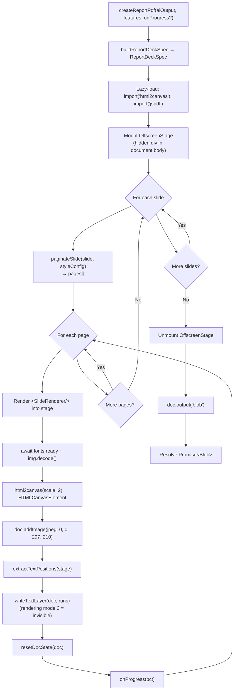

# Design Document — `pdf-report-html-render`

## Overview

The Feature Tracker generates a visual PDF deck from an AI-produced slide spec. The current renderer (`src/app/services/pdf-report.ts`) draws every slide using the jsPDF primitive API: `doc.text`, `doc.rect`, `doc.line`, manual layout math, hand-tuned font sizing, and per-shape state plumbing. After several rounds of bugfixes (`pdf-report-bugfix`, `pdf-report-quality`) the visual quality is still limited by jsPDF: no CSS, no real typography control, awkward image embedding, and brittle layout code.

This feature replaces the renderer with a **hybrid HTML + raster + transparent text overlay** pipeline:

1. **Compose** each slide as a React component styled with the existing Tailwind / shadcn theme.
2. **Mount** the slide off-screen in a hidden DOM container at A4 landscape dimensions (1123 × 794 px @ 96 DPI; rendered at `scale: 2` by `html2canvas` for retina sharpness, ≈ 192 effective DPI which exceeds the 144 DPI floor of Requirement 3.5).
3. **Capture** the rendered DOM with `html2canvas`, then embed the resulting raster into a jsPDF document at the full page rectangle (0, 0, 297 × 210 mm) via `doc.addImage(dataUrl, "JPEG", ...)`.
4. **Re-emit** the textual content as a **transparent text layer** on top of the raster (`jsPDF.text` calls with text rendering mode `3`, "invisible") so the resulting PDF still has selectable, copy-paste-able, searchable text.

The deck builder (`buildReportDeckSpec`), the slide spec types (`ReportDeckSpec`), the orchestrator (`generateVisualDeckReport`), and the calling UI (`AiAgentPanel` / `ReportAttachmentCard`) are all unchanged. The public entry point `createReportPdf(aiOutput, features, onProgress?)` keeps its signature so no caller has to be modified.

The MVP renders all slides in the existing dashboard style (teal `#02878d`, Inter / Helvetica typography, shadcn neutral scale). The design also leaves a **documented seam** (`StyleConfig`) for a future iteration in which AI Training entries with domain `document_template` can supply style overrides through the same renderer; that wiring is explicitly out of scope for this spec.

**Why this approach?**

- The existing `pdf-report.ts` reimplements layout primitives that the browser already has (flexbox, grid, rounded corners, drop shadows, gradients). Rendering through React + Tailwind eliminates that duplication.
- `html2canvas` produces pixel-perfect raster captures of arbitrary DOM, which gives us full visual fidelity with the dashboard for free.
- A pure-raster PDF would lose text selectability and search, which Requirement 5 forbids. Layering an invisible jsPDF text overlay on top of the raster gives us **both** visual fidelity **and** selectable text.
- Lazy-loading `html2canvas` + `jspdf` via dynamic `import()` keeps the renderer out of the initial app bundle (Requirement 13.4).

**Addresses:** Requirements 1, 2, 3, 5, 12, 13.

## Architecture

### Pipeline diagram



### Module map

```
src/app/services/
├── pdf-report.ts                       (entry point — re-exports renderHtmlPdf as createReportPdf,
│                                        re-exports buildReportDeckSpec)
├── report-rendering/
│   ├── index.ts                        (public exports for the renderer subsystem)
│   ├── render-html-pdf.ts              (main pipeline: orchestrates stage → capture → addImage → overlay)
│   ├── style-config.ts                 (StyleConfig type + DEFAULT_STYLE_CONFIG + applyStyleConfigVars)
│   ├── offscreen-stage.tsx             (OffscreenStage helper: mount/unmount the hidden container)
│   ├── slide-renderer.tsx              (dispatch by slide.type, applies StyleConfig at the root)
│   ├── slide-frame.tsx                 (shared chrome: kicker + title card, page badge, footer)
│   ├── text-overlay.ts                 (extractTextPositions + writeTextLayer)
│   ├── pagination.ts                   (paginateSlide helper for recommendation/appendix overflow)
│   ├── pdf-state.ts                    (resetDocState + setTextRenderingMode helpers)
│   ├── slides/
│   │   ├── cover-slide.tsx
│   │   ├── metric-snapshot-slide.tsx
│   │   ├── visual-evidence-slide.tsx
│   │   ├── comparison-slide.tsx
│   │   ├── risk-matrix-slide.tsx
│   │   ├── flowchart-slide.tsx
│   │   ├── recommendation-slide.tsx
│   │   ├── appendix-slide.tsx
│   │   └── text-only-fallback-slide.tsx
│   └── hooks/
│       └── use-fonts-ready.ts
├── report-deck.ts                      (UNCHANGED — still emits ReportDeckSpec)
├── report-types.ts                     (UNCHANGED — still owns ReportDeckSpec / ReportDeckSlide)
├── report-generation.ts                (UNCHANGED — still calls createReportPdf)
└── report-artifacts.ts                 (UNCHANGED — still uploads the resulting Blob)
```

`pdf-report.ts` becomes a thin shim:

```ts
// src/app/services/pdf-report.ts
import type { Feature } from "../data/features";
import { renderHtmlPdf } from "./report-rendering";
import { DEFAULT_STYLE_CONFIG, type StyleConfig } from "./report-rendering/style-config";

export { buildReportDeckSpec } from "./report-deck";
export type { StyleConfig } from "./report-rendering/style-config";

export function createReportPdf(
  aiOutput: string,
  features: Feature[],
  onProgress?: (progress: number) => void,
): Promise<Blob> {
  // Internal seam: future AI-Training-driven config will pass a StyleConfig here.
  return renderHtmlPdf({
    aiOutput,
    features,
    onProgress,
    styleConfig: DEFAULT_STYLE_CONFIG,
  });
}
```

**Addresses:** Requirements 1.1, 1.7, 8.1, 8.4, 12.1, 12.4.

### Capture loop pseudocode

```ts
// render-html-pdf.ts (essence; full signatures in §3 below)
export async function renderHtmlPdf(args: RenderArgs): Promise<Blob> {
  const { aiOutput, features, onProgress, styleConfig } = args;

  const deck = buildReportDeckSpec(aiOutput, features);
  onProgress?.(2);

  const [{ default: html2canvas }, { jsPDF }] = await Promise.all([
    import("html2canvas"),
    import("jspdf"),
  ]);
  onProgress?.(5);

  const doc = new jsPDF({ orientation: "landscape", unit: "mm", format: "a4" });
  const stage = mountOffscreenStage();

  try {
    // 1. Expand each slide into one or more pages (continuation pages for overflow).
    const pages: RenderedSlidePage[] = deck.slides.flatMap((slide, slideIndex) =>
      paginateSlide(slide, styleConfig).map((page, pageIndex) => ({
        slide: page,
        slideIndex,
        isContinuation: pageIndex > 0,
        continuationLabel: pageIndex > 0 ? "lanjutan" : undefined,
      })),
    );

    for (let i = 0; i < pages.length; i++) {
      if (i > 0) doc.addPage("a4", "landscape");
      await renderOnePage(doc, stage, pages[i], styleConfig, html2canvas);
      resetDocState(doc);
      const pct = 5 + Math.round(((i + 1) / pages.length) * 90);
      onProgress?.(Math.min(95, pct));
    }
  } finally {
    stage.unmount();
  }

  const blob = doc.output("blob");
  onProgress?.(100);
  return blob;
}
```

Slides are rendered **serially**, never in parallel: there is one shared off-screen stage, so two parallel `html2canvas` calls would race on the same DOM. Serial rendering also keeps memory pressure low. Performance is still well inside the 10-second budget for ≤ 10 slides on modern hardware (Requirement 9.1).

**Addresses:** Requirements 9.1, 9.3, 9.4.

## Components and Interfaces

### 3.1 Public entry point — `pdf-report.ts`

```ts
// src/app/services/pdf-report.ts

/**
 * Render an AI-produced visual deck into a PDF blob.
 *
 * Drop-in replacement for the previous jsPDF-only renderer. Public surface
 * (name, arguments, return type) is preserved so existing callers in
 * report-generation.ts and AiAgentPanel keep working unchanged.
 *
 * @param aiOutput   Raw Gemini output (JSON string per the deck builder prompt).
 * @param features   The current feature list (used by buildReportDeckSpec).
 * @param onProgress Optional 0..100 monotonically non-decreasing progress callback.
 *                   Final invocation is always exactly 100.
 *                   Omit to skip progress tracking entirely.
 * @returns          Promise resolving to a `Blob` of type `application/pdf`.
 */
export function createReportPdf(
  aiOutput: string,
  features: Feature[],
  onProgress?: (progress: number) => void,
): Promise<Blob>;

/** Re-exported from report-deck.ts so existing imports keep working. */
export { buildReportDeckSpec } from "./report-deck";
```

**Addresses:** Requirements 1.1, 1.2, 1.3, 1.4, 1.5, 1.7, 12.1.

### 3.2 Internal renderer — `report-rendering/render-html-pdf.ts`

```ts
import type { Feature } from "../../data/features";
import type { StyleConfig } from "./style-config";

export type RenderArgs = {
  aiOutput: string;
  features: Feature[];
  onProgress?: (progress: number) => void;
  /**
   * Style overrides. Defaults to DEFAULT_STYLE_CONFIG when omitted.
   *
   * @future The intended source of overrides is AI Training entries with
   * domain `document_template`. The renderer does NOT read from the training
   * store; a future iteration will add a thin adapter in report-generation.ts
   * that maps training entries to StyleConfig and passes them in.
   */
  styleConfig?: StyleConfig;
};

export function renderHtmlPdf(args: RenderArgs): Promise<Blob>;
```

`renderHtmlPdf` is the **internal entry point that future code wires AI-Training overrides into.** `createReportPdf` delegates to it with `DEFAULT_STYLE_CONFIG`. This is the working internal infrastructure required by Requirement 8.1.

**Addresses:** Requirements 1.1, 8.1, 8.3, 8.4, 8.6.

### 3.3 Slide renderer dispatch — `slide-renderer.tsx`

```ts
import type { ReportDeckSlide } from "../report-types";
import type { StyleConfig } from "./style-config";

export type SlideRendererProps = {
  slide: ReportDeckSlide;
  styleConfig: StyleConfig;
  /** 1-based page index in the final PDF (used by the page badge). */
  pageIndex: number;
  /** Total number of pages in the final PDF. */
  totalPages: number;
  /** True when this slide is a continuation page (suffixed with " (lanjutan)"). */
  isContinuation?: boolean;
  /** Per-slide ready callback. The pipeline awaits this before capturing. */
  onReady: () => void;
};

export function SlideRenderer(props: SlideRendererProps): JSX.Element;
```

The component dispatches by `slide.type` to the per-type slide component. The root element is a fixed-size `<div>` of exactly **1123 × 794 px** (A4 landscape at 96 DPI), with `box-sizing: border-box` so internal padding does not change those outer dimensions. Style configuration is applied at the root via inline CSS variables (see §3.6).

`onReady` resolves once both `document.fonts.ready` has settled **and** every `` inside the slide has either resolved or rejected its `img.decode()` promise. The pipeline awaits this signal before invoking `html2canvas`, eliminating a class of flaky captures where text was rendered with a fallback font or images were not yet decoded.

**Addresses:** Requirements 2.1, 2.3, 2.4, 3.1, 3.3, 3.4, 7.1.

### 3.4 Per-slide components — `report-rendering/slides/*.tsx`

Every slide component has the same prop shape:

```ts
export type SlideComponentProps = {
  slide: ReportDeckSlide;
  styleConfig: StyleConfig;
  pageIndex: number;
  totalPages: number;
  isContinuation?: boolean;
  onReady: () => void;
};
```

| File | Renders | Notes |
| --- | --- | --- |
| `cover-slide.tsx` | `cover` | "VISUAL DECK" panel + 6 metric cards + 2 bullets. |
| `metric-snapshot-slide.tsx` | `metric_snapshot` | 6 metric cards + status chip cluster + bullets. |
| `visual-evidence-slide.tsx` | `visual_evidence` | Single image card + bullets + source refs. |
| `comparison-slide.tsx` | `comparison` | Side-by-side image cards + shared bullets. |
| `risk-matrix-slide.tsx` | `risk_matrix` | Scatter-plot SVG with axis labels + bullets. |
| `flowchart-slide.tsx` | `flowchart` | Flowchart shapes (start/end pill, decision diamond, parallelogram, database, process), directed arrows, labels. |
| `recommendation-slide.tsx` | `recommendation` | Numbered tone-coded action cards. |
| `appendix-slide.tsx` | `appendix` | Source map list. |
| `text-only-fallback-slide.tsx` | any | Minimal text-only layout used when capture or `addImage` fails (Requirement 10.1, 10.2, 10.4). |

Every slide is wrapped in `<SlideFrame>` (§3.5), which owns the kicker + title card and the page badge in the top-right.

**Slide preserves the cover identity** (Requirement 2.5): the cover component renders the VISUAL DECK panel and the 6 metric cards in the same relative positions as the existing renderer. The visual identity is preserved through component-level layout, not through a 1:1 port of `pdf-report.ts` math.

**Addresses:** Requirements 2.1, 2.3, 2.5, 2.6, 2.7, 4.1, 4.2, 4.6.

### 3.5 Shared chrome — `slide-frame.tsx`

```ts
export type SlideFrameProps = {
  title: string;
  kicker?: string;
  pageIndex: number;        // 1-based, 2-digit zero-padded badge
  isContinuation?: boolean; // when true, append " (lanjutan)" to title
  styleConfig: StyleConfig;
  children: ReactNode;      // slide body
  footer?: ReactNode;       // optional source-refs strip
};

export function SlideFrame(props: SlideFrameProps): JSX.Element;
```

The frame renders the page background, the teal accent stripe on the left edge, the kicker + title card in the header, and the page badge in the top-right. It centralizes chrome so per-slide components only worry about the body.

**Addresses:** Requirements 2.5, 3.4, 6.2, 7.3.

### 3.6 Style configuration — `style-config.ts`

```ts
/**
 * Style configuration for the PDF renderer.
 *
 * Every visual decision (colors, fonts, density, brand mark) routes through
 * this object so a future iteration can override defaults without changing
 * any slide component.
 *
 * @future The intended source of overrides is AI Training entries with domain
 * `document_template` (see AiTrainingDomain in src/app/data/firestore-db.ts).
 * The renderer does NOT read from the training store directly. A future
 * iteration will add a thin adapter layer in report-generation.ts that maps
 * `document_template` entries to StyleConfig and passes them in via
 * `renderHtmlPdf({ ..., styleConfig })`.
 */
export type StyleConfig = {
  /** Primary accent (default: dashboard teal #02878d). */
  primaryAccent: string;
  /** Soft accent for backgrounds (default: tealSoft #f0fafb). */
  secondaryAccent: string;
  /** Shadcn-style neutral scale 50..900. */
  neutralScale: {
    50: string; 100: string; 200: string; 300: string; 400: string;
    500: string; 600: string; 700: string; 800: string; 900: string;
  };
  /** Body font stack (default: "Inter, Helvetica, sans-serif"). */
  bodyFont: string;
  /** Heading font stack (default: same as bodyFont). */
  headingFont: string;
  /** Spacing density preset. */
  density: "compact" | "comfortable";
  /** Optional brand mark to render in the slide frame. */
  brandMark?: { src: string; alt: string };
};

export const DEFAULT_STYLE_CONFIG: StyleConfig;

/**
 * Returns the inline style object that injects StyleConfig as CSS variables
 * on the slide root element. Slide components reference these via Tailwind
 * arbitrary values (`bg-[var(--accent)]`) or inline styles.
 */
export function applyStyleConfigVars(config: StyleConfig): CSSProperties;
```

`applyStyleConfigVars` returns:

```ts
{
  "--accent": config.primaryAccent,
  "--accent-soft": config.secondaryAccent,
  "--neutral-50": config.neutralScale[50],
  // ...up through --neutral-900
  "--body-font": config.bodyFont,
  "--heading-font": config.headingFont,
  fontFamily: config.bodyFont,
}
```

Every slide component references these CSS variables via Tailwind arbitrary values (e.g. `bg-[var(--accent)]`, `text-[var(--neutral-700)]`) or inline styles. **No slide component hardcodes a color, font, or radius that would shadow `StyleConfig`** (Requirement 8.6).

`DEFAULT_STYLE_CONFIG`:

```ts
export const DEFAULT_STYLE_CONFIG: StyleConfig = {
  primaryAccent: "#02878d",
  secondaryAccent: "#f0fafb",
  neutralScale: {
    50: "#fafafa",  100: "#f5f5f5", 200: "#e5e5e5", 300: "#d4d4d4",
    400: "#a3a3a3", 500: "#737373", 600: "#525252", 700: "#404040",
    800: "#262626", 900: "#171717",
  },
  bodyFont: "Inter, Helvetica, sans-serif",
  headingFont: "Inter, Helvetica, sans-serif",
  density: "comfortable",
};
```

**Addresses:** Requirements 3.1, 3.2, 3.3, 7.3, 7.4, 8.1, 8.2, 8.3, 8.5, 8.6.

### 3.7 Off-screen stage — `offscreen-stage.tsx`

```ts
export type OffscreenStageHandle = {
  /** The hidden container element attached to document.body. */
  container: HTMLDivElement;
  /**
   * Renders `node` into the stage and resolves once the slide has signalled
   * `onReady` (fonts loaded, images decoded). Subsequent calls re-render the
   * tree on the same React root.
   */
  renderSlide(node: ReactElement): Promise<void>;
  /** Unmounts the React tree and removes the container from the DOM. */
  unmount(): void;
};

export function mountOffscreenStage(): OffscreenStageHandle;
```

Implementation sketch:

```ts
export function mountOffscreenStage(): OffscreenStageHandle {
  const container = document.createElement("div");
  container.setAttribute("data-offscreen-stage", "");
  container.style.cssText = [
    "position: fixed",
    "left: -10000px",
    "top: 0",
    "width: 1123px",
    "height: 794px",
    "pointer-events: none",
    "opacity: 0",
    "z-index: -1",
  ].join("; ");
  document.body.appendChild(container);
  const root = createRoot(container);

  return {
    container,
    renderSlide(node) {
      return new Promise<void>((resolve) => {
        // Wrap the node so it can call back when ready.
        const wrapped = cloneElement(node, { onReady: () => resolve() });
        root.render(wrapped);
      });
    },
    unmount() {
      root.unmount();
      container.remove();
    },
  };
}
```

The container uses `position: fixed; left: -10000px` rather than `display: none` so layout, fonts, and images actually compute. `pointer-events: none` and `opacity: 0` keep it invisible to users even if a developer briefly inspects the DOM.

**Addresses:** Requirements 7.1, 9.4.

### 3.8 Text overlay — `text-overlay.ts`

```ts
/** A single run of selectable text, in millimetres relative to the page top-left. */
export type TextRun = {
  text: string;
  /** Page-space x of the text baseline-left, in mm. */
  x: number;
  /** Page-space y of the text baseline, in mm. */
  y: number;
  /** Font size in mm (converted from computed px). */
  fontSizeMm: number;
};

/**
 * Walks the rendered slide DOM and produces one TextRun per non-empty text
 * node, in document order. Returned coordinates are in PDF page space (mm).
 */
export function extractTextPositions(
  slideElement: HTMLElement,
  pageWidthMm: number,   // 297
  pageHeightMm: number,  // 210
): TextRun[];

/**
 * Writes the text runs into the PDF as an invisible (mode 3) text layer on
 * top of the current page's raster.
 *
 * - Sets text rendering mode to 3 (invisible) before each text() call.
 * - Restores draw state at the end via the snapshot/restore helpers.
 * - On any internal jsPDF error, logs and returns; the page still has its
 *   raster, just no selectable text for that slide (Requirement 5/10).
 */
export function writeTextLayer(doc: jsPDF, runs: TextRun[]): void;
```

**Coordinate conversion.** The slide is rendered at exactly 1123 × 794 px. The PDF page is 297 × 210 mm. For each text node:

```ts
const range = document.createRange();
range.selectNodeContents(node);
const r = range.getBoundingClientRect();
const s = slideElement.getBoundingClientRect();

const xMm = ((r.left - s.left) / s.width)  * pageWidthMm;   // mm
const yMm = ((r.bottom - s.top) / s.height) * pageHeightMm; // mm — bottom because jsPDF uses baseline-ish

const fontSizePx = parseFloat(getComputedStyle(node.parentElement!).fontSize);
const fontSizeMm = (fontSizePx / 96) * 25.4;
```

Rounding errors of less than 1 px at 96 DPI translate to less than 0.27 mm in PDF space, well inside the ±2 mm tolerance of Requirement 5.4.

**Text rendering mode 3.** jsPDF v2.5+ exposes `setTextRenderingMode(3)`. The renderer uses that path when present and falls back to writing the raw PDF operator `3 Tr` into the content stream via `doc.internal.write("3 Tr")` when not. After the layer is written, the renderer restores rendering mode via `doc.setTextRenderingMode(0)` (or `0 Tr`) so subsequent text on the next page renders normally if anything tries to draw it.

**Selectability over de-duplication.** Per Requirement 5.5, when a placement choice conflicts between visible-duplicate avoidance and selectability, the renderer keeps the run and relies on mode 3 to keep the layer invisible.

**Addresses:** Requirements 5.1, 5.2, 5.3, 5.4, 5.5, 7.2.

### 3.9 Pagination — `pagination.ts`

```ts
/**
 * Splits a slide whose body would overflow A4 landscape into a source page
 * and zero or more continuation pages. Returns slides whose `title` field
 * already has the " (lanjutan)" suffix applied to continuations.
 *
 * Most slide types have fixed layouts and return [slide]. Only `recommendation`
 * and `appendix` actually split.
 */
export function paginateSlide(
  slide: ReportDeckSlide,
  styleConfig: StyleConfig,
): ReportDeckSlide[];
```

**Strategy.**

- For `cover`, `metric_snapshot`, `visual_evidence`, `comparison`, `risk_matrix`, `flowchart`: layout is bounded at the data layer (the deck builder caps cards at 6, chips at 12, matrix items at 10, etc., per `report-deck.ts`). These types return `[slide]` unconditionally.
- For `recommendation` and `appendix`: split content arrays (`bullets`, `sourceRefs`) into chunks that fit within the body region. The split height is computed from `styleConfig.density` (`compact` ≈ 28 mm of body per item, `comfortable` ≈ 36 mm).
- Continuation pages set `isContinuation = true`, which `SlideFrame` translates into a `" (lanjutan)"` suffix on the title.

For each chunk a deep-cloned `ReportDeckSlide` is produced with the relevant array narrowed to that chunk. `ReportDeckSpec` and `ReportDeckSlide` types are not modified (Requirement 12.4): pagination is internal to the renderer.

**Addresses:** Requirements 6.1, 6.2, 6.3, 6.4, 6.5, 12.4.

### 3.10 Capture single page — `renderOnePage` (in `render-html-pdf.ts`)

```ts
async function renderOnePage(
  doc: jsPDF,
  stage: OffscreenStageHandle,
  page: RenderedSlidePage,
  styleConfig: StyleConfig,
  html2canvas: typeof import("html2canvas").default,
): Promise<void> {
  try {
    await stage.renderSlide(
      <SlideRenderer
        slide={page.slide}
        styleConfig={styleConfig}
        pageIndex={page.pageIndex}
        totalPages={page.totalPages}
        isContinuation={page.isContinuation}
      />
    );

    const canvas = await html2canvas(stage.container, {
      scale: 2,                  // 192 effective DPI (Requirement 3.5: ≥ 144)
      backgroundColor: "#ffffff",
      useCORS: true,
      logging: false,
      width: 1123,
      height: 794,
      windowWidth: 1123,
      windowHeight: 794,
    });

    const dataUrl = canvas.toDataURL("image/jpeg", 0.92);
    doc.addImage(dataUrl, "JPEG", 0, 0, 297, 210, undefined, "FAST");

    // Selectable text overlay — never blocks page completion.
    try {
      const runs = extractTextPositions(stage.container, 297, 210);
      writeTextLayer(doc, runs);
    } catch (err) {
      console.warn(
        `[pdf-report] text overlay failed for slide #${page.slideIndex} (${page.slide.type}); raster only`,
        err,
      );
    }
  } catch (captureErr) {
    console.warn(
      `[pdf-report] capture failed for slide #${page.slideIndex} (${page.slide.type}); falling back to text-only`,
      captureErr,
    );
    await renderTextOnlyFallback(doc, stage, page, styleConfig, html2canvas);
  }
}
```

`renderTextOnlyFallback` mounts `<TextOnlyFallbackSlide/>` (which has no images, no SVG, no gradients — only black text on a white background) and runs the same capture + overlay path. If even that fails, the page still exists in the PDF (jsPDF's `addPage` already added it) and the renderer moves on. This guarantees the final blob is always a valid PDF (Requirement 10.6, 11.2).

**Addresses:** Requirements 3.5, 5.1, 7.2, 10.1, 10.2, 10.4, 10.5, 10.6, 11.2.

### 3.11 Document state reset — `pdf-state.ts`

```ts
/**
 * Resets jsPDF state to the renderer baseline before drawing the text layer
 * of every slide. Idempotent. Must be called at the start of each page so
 * that a previous slide's font/color never leaks into the next.
 */
export function resetDocState(doc: jsPDF): void;

/**
 * Sets jsPDF text rendering mode. Wraps the v2.5+ method when available and
 * falls back to writing the raw PDF operator `<mode> Tr`.
 */
export function setTextRenderingMode(doc: jsPDF, mode: 0 | 3): void;
```

**Addresses:** Requirements 7.2, 5.2.

### 3.12 Fonts ready hook — `hooks/use-fonts-ready.ts`

```ts
/**
 * Resolves to true once `document.fonts.ready` settles AND every 
 * descendant of `ref.current` has fired its `decode()` resolve/reject.
 *
 * Used by every slide component to fire `onReady` exactly once, so the
 * pipeline never captures a slide whose font is still falling back to
 * the user-agent default.
 */
export function useFontsReady(ref: RefObject<HTMLElement>): boolean;
```

**Addresses:** Requirements 3.3, 4.4, 9.3.

## Data Models

This feature adds three new internal types and **does not change** any of the existing public types in `report-types.ts` (Requirement 12.4).

### 4.1 Existing types — preserved verbatim

| Type | Module | Status |
| --- | --- | --- |
| `ReportAttachmentMetadata` | `report-types.ts` | unchanged |
| `ReportDeckTone` | `report-types.ts` | unchanged |
| `ReportDeckSlideType` | `report-types.ts` | unchanged |
| `MetricCard` | `report-types.ts` | unchanged |
| `StatusChip` | `report-types.ts` | unchanged |
| `DeckImage` | `report-types.ts` | unchanged |
| `RiskMatrixItem` | `report-types.ts` | unchanged |
| `ReportDeckSlide` | `report-types.ts` | unchanged |
| `ReportSource` | `report-types.ts` | unchanged |
| `ReportDeckSpec` | `report-types.ts` | unchanged |

### 4.2 New internal types

```ts
// style-config.ts
export type StyleConfig = {
  primaryAccent: string;
  secondaryAccent: string;
  neutralScale: Record<50 | 100 | 200 | 300 | 400 | 500 | 600 | 700 | 800 | 900, string>;
  bodyFont: string;
  headingFont: string;
  density: "compact" | "comfortable";
  brandMark?: { src: string; alt: string };
};

// text-overlay.ts
export type TextRun = {
  text: string;
  x: number;          // mm, page-space
  y: number;          // mm, page-space (baseline)
  fontSizeMm: number; // mm
};

// offscreen-stage.tsx
export type OffscreenStageHandle = {
  container: HTMLDivElement;
  renderSlide(node: ReactElement): Promise<void>;
  unmount(): void;
};

// render-html-pdf.ts
export type RenderedSlidePage = {
  slide: ReportDeckSlide;
  /** Index of the source slide in `ReportDeckSpec.slides`. Continuation pages share this. */
  slideIndex: number;
  /** 1-based PDF page index. */
  pageIndex: number;
  /** Total number of PDF pages. */
  totalPages: number;
  /** True when this is a continuation page of `slide`. */
  isContinuation: boolean;
  /** Always "lanjutan" for continuation pages (or undefined). */
  continuationLabel?: string;
};
```

`RenderedSlidePage` is the unit consumed by the per-page render loop. It is constructed by flat-mapping each `ReportDeckSlide` through `paginateSlide`. It exists so the loop has a single uniform iteration target, and so the source slide index stays attached for error logging (Requirement 10.5).

**Addresses:** Requirements 8.2, 12.4.

## Glossary

- **OffscreenStage** — the hidden DOM container, attached to `document.body` outside the viewport, into which the renderer mounts each slide for capture. See `offscreen-stage.tsx`. Released before the returned `Promise<Blob>` resolves (Requirement 9.4).
- **SlideRenderer** — the React component that dispatches by `slide.type` to a per-type slide component, applies the `StyleConfig` at the root via CSS variables, and signals readiness once fonts and images are loaded. See `slide-renderer.tsx`.
- **StyleConfig** — the configuration object that controls every visual decision (colors, fonts, density, brand mark). The MVP uses `DEFAULT_STYLE_CONFIG`. The future seam: `document_template` AI Training entries map to this object.
- **TextLayer** — the set of `jsPDF.text` calls placed on top of the raster image with text rendering mode `3` (invisible), so the PDF has selectable, copy-paste-able, searchable text without visible duplication.
- **ContinuationPage** — an additional PDF page that holds the overflow content of a slide whose body does not fit on a single A4 landscape page. Its title equals the source slide's title with the suffix `" (lanjutan)"` appended.
- **Pdf_Safe_Image** — a data-URL image that passes the existing `isPdfSafeDataImage` predicate in `report-deck.ts`: a `data:image/{png|jpeg|jpg|webp}` URL whose decoded payload is ≤ 700 KB. Anything else falls back to a placeholder (Requirement 4.3).
- **TextOnlyFallbackSlide** — the minimal text-only React component used when `html2canvas` or `addImage` fails for a slide. Has no images, SVG, or gradients, so it is unlikely to fail capture itself.
- **RenderedSlidePage** — the unit consumed by the per-page render loop, constructed by flat-mapping `paginateSlide` over `ReportDeckSpec.slides`. Carries the source slide, the source slide index (for error logging), the 1-based PDF page index, total page count, and a continuation flag.


## Correctness Properties

*A property is a characteristic or behavior that should hold true across all valid executions of a system — essentially, a formal statement about what the system should do. Properties serve as the bridge between human-readable specifications and machine-verifiable correctness guarantees.*

The following properties are derived from the prework analysis, consolidated to remove redundancy. Each property is universally quantified and references the requirement(s) it validates. Acceptance criteria classified as `SMOKE`, `EXAMPLE`, or `EDGE_CASE` are not listed here; they are covered by example-based unit tests, edge-case tests, or single-shot smoke tests in the Testing Strategy section.

### Property 1: onProgress is a valid monotone progress sequence

*For all* decks of length 0 ≤ N ≤ 10 and any provided `onProgress` callback, the sequence of values passed to `onProgress` during a single invocation of `createReportPdf` consists of integers in the closed range [0, 100], is non-decreasing, and ends with the literal value 100 in its final element.

**Validates: Requirements 1.4**

### Property 2: Determinism across structurally equal inputs

*For any* pair of `(aiOutput, features)` arguments that are structurally equal, two successive calls to `createReportPdf` in the same browser session produce PDFs with the same page count and the same concatenated selectable-text content (per page, in document order).

**Validates: Requirements 1.6**

### Property 3: Page count equals expected pagination output

*For any* `(aiOutput, features)` input the deck builder accepts, the produced PDF's page count equals `Σ slides paginateSlide(slide, styleConfig).length`. The order of pages in the PDF matches the order produced by flat-mapping `paginateSlide` over `ReportDeckSpec.slides`.

**Validates: Requirements 2.2, 6.4, 11.3**

### Property 4: Every slide type in the deck produces at least one page

*For any* `(aiOutput, features)` input, for every `slide.type` value that appears in the produced `ReportDeckSpec.slides`, the rendered PDF contains at least one page whose source slide had that type.

**Validates: Requirements 2.1**

### Property 5: Present slide fields appear in the rendered DOM

*For any* `ReportDeckSlide`, when rendered through `SlideRenderer` into a jsdom document, every present and non-empty textual field (`title`, `headline`, `kicker`, each entry of `bullets`, each `metricCards[*].label/value`, each `chips[*].label/value`, each `sourceRefs[*]`, each image `caption`) appears at least once in the rendered DOM's text content.

**Validates: Requirements 2.3, 2.4, 4.6**

### Property 6: Present slide fields appear in the extracted TextRun list

*For any* `ReportDeckSlide`, when rendered through `SlideRenderer` and walked by `extractTextPositions`, every present and non-empty textual field of the slide appears in at least one `TextRun.text` (after trimming and case-insensitive comparison).

**Validates: Requirements 5.1, 5.5**

### Property 7: Selectable text appears in the parsed PDF stream

*For any* `(aiOutput, features)` input, when the produced PDF is parsed with a PDF text-extraction library (e.g. `pdfjs-dist`), the concatenated extracted text across all pages contains every textual field of every `ReportDeckSlide` in the source deck (titles, headlines, kickers, bullets, chip and metric labels and values, source refs, and image captions).

**Validates: Requirements 5.3, 6.5**

### Property 8: Text overlay coordinate conversion stays within tolerance

*For any* DOM fixture whose text-node geometry is known in CSS pixels relative to a 1123 × 794 px slide root, the `TextRun` produced by `extractTextPositions` has `(x, y)` in millimetres that match the analytical conversion `((px / slideSizePx) * pageSizeMm)` to within 0.27 mm (one CSS pixel at 96 DPI), which is well inside the ±2 mm tolerance.

**Validates: Requirements 5.4**

### Property 9: Pagination partitions content losslessly

*For any* `ReportDeckSlide` of type `recommendation` or `appendix`, the concatenation (in order) of the `bullets` arrays across the slides returned by `paginateSlide(slide, styleConfig)` equals the original `slide.bullets`. The same equality holds for `sourceRefs`. No element is duplicated, omitted, or reordered.

**Validates: Requirements 6.3**

### Property 10: Continuation pages carry the "(lanjutan)" suffix

*For any* `ReportDeckSlide` whose `paginateSlide` output has length K ≥ 2, every page after the first has `title === sourceTitle + " (lanjutan)"`, and the first page's title equals `sourceTitle`.

**Validates: Requirements 6.2**

### Property 11: StyleConfig flows through to every slide root

*For any* `StyleConfig` value and any `ReportDeckSlide`, the rendered slide's root element exposes CSS custom properties whose values equal `applyStyleConfigVars(styleConfig)` — specifically `--accent`, `--accent-soft`, every `--neutral-*`, and the resolved `fontFamily`. No slide hardcodes a value that shadows these.

**Validates: Requirements 7.3, 7.4, 8.6**

### Property 12: Pdf_Safe_Image is embedded; non-safe images render the placeholder

*For any* `ReportDeckSlide` of type `visual_evidence` or `comparison` and any image input, when the image src is a `Pdf_Safe_Image` the rendered DOM contains an `` element with that src and no placeholder element; otherwise the rendered DOM contains the placeholder element with the image's `label` and `caption` text and no ``.

**Validates: Requirements 4.1, 4.3, 4.5**

### Property 13: Comparison images render in input order

*For any* `ReportDeckSlide` of type `comparison` whose `images` array contains only `Pdf_Safe_Image` entries, the rendered DOM contains `` elements in document order whose `src` values equal the input array element-wise.

**Validates: Requirements 4.2**

### Property 14: Flowchart renders one element per node and one arrow per edge

*For any* `FlowChartDefinition`, when rendered through `FlowchartSlide`, the rendered DOM contains exactly one node element per `FlowChartNode` (identified by `data-node-id`) and at least one arrow element per `FlowChartEdge` (identified by `data-edge-from-to`).

**Validates: Requirements 2.7**

### Property 15: Risk matrix renders one dot per item and axis labels

*For any* array of `RiskMatrixItem`, when rendered through `RiskMatrixSlide`, the rendered DOM contains exactly one dot element per item plus the four axis labels ("Low evidence", "High risk", "Lower risk", "More evidence").

**Validates: Requirements 2.6**

### Property 16: Robustness — final blob is always a valid PDF

*For any* `(aiOutput, features)` input that produces a non-empty deck, even when `html2canvas` is forced to throw on every slide, the returned `Blob` has `type === "application/pdf"` and `size > 0`.

**Validates: Requirements 10.6, 11.2**

### Property 17: Output blob is below the size cap

*For any* `(aiOutput, features)` input the deck builder accepts under existing image-size constraints (≤ 700 KB per `Pdf_Safe_Image`), the returned `Blob` has `size < 25 * 1024 * 1024` bytes.

**Validates: Requirements 11.1**

### Property 18: Off-screen stage is released before resolution

*For any* invocation of `createReportPdf`, after the returned `Promise<Blob>` resolves, `document.querySelector("[data-offscreen-stage]")` returns `null`.

**Validates: Requirements 9.4**

### Property 19: onProgress is invoked at least once per slide

*For any* deck of length N ≥ 1 and any provided `onProgress`, the callback is invoked at least N times during a single invocation of `createReportPdf`.

**Validates: Requirements 9.3**

### Property 20: html2canvas and jspdf are loaded only via dynamic import

*For all* modules in the renderer subgraph reachable statically from `src/app/services/pdf-report.ts`, the strings `"html2canvas"` and `"jspdf"` only appear as the argument to a dynamic `import()` expression, never as the source of a static `import` statement.

**Validates: Requirements 13.4**

### Property 21: Per-slide failure log identifies the failing slide

*For any* `(aiOutput, features)` input and any subset of slides whose capture is forced to fail, every failure is logged via `console.warn` with a message containing the slide index and the slide `type`.

**Validates: Requirements 10.5**

## Error Handling

The renderer must always resolve with a valid `application/pdf` blob whenever the deck contains at least one slide (Requirement 10.6). Errors are scoped to the smallest possible unit and never abort the whole pipeline.

### 6.1 Per-slide try/catch matrix

| Failure source | Handler | User-visible result |
| --- | --- | --- |
| `paginateSlide(slide)` throws | Outer catch around the slide; treat as a single source page; emit one fallback page | Single fallback page for that slide |
| `stage.renderSlide(node)` rejects | Caught by `renderOnePage`; attempt `renderTextOnlyFallback` | Text-only fallback page |
| `html2canvas(stage.container, …)` throws | Caught by `renderOnePage`; attempt `renderTextOnlyFallback` | Text-only fallback page (Req 10.1) |
| `doc.addImage(dataUrl, …)` throws | Caught by `renderOnePage`; attempt `renderTextOnlyFallback` | Text-only fallback page (Req 10.2) |
| `extractTextPositions` or `writeTextLayer` throws | Inner try/catch; log and continue | Page raster present, text not selectable on that page (Req 5/10) |
| `` load/decode fails inside slide | `<ImageWithFallback>` swaps in placeholder before `onReady` resolves | Placeholder rendered with label/caption (Req 4.4, 10.3) |
| CSS feature unsupported by html2canvas produces broken capture | The capture still succeeds (just visually broken); detection is best-effort. We force the text-only fallback path when post-capture validation finds the canvas is fully blank (all-white) | Fallback emits at least title + headline + bullets in the text layer (Req 10.4) |
| `renderTextOnlyFallback` itself throws | Final catch around the page loop; log; the empty PDF page already exists | Empty page in the PDF, but PDF still valid (Req 10.6) |
| `doc.output("blob")` throws | Caught at the top level; reject with a clear error message | `createReportPdf` rejects with error |
| `mountOffscreenStage` throws (no DOM available) | Caught at the top level; reject with a clear error message | `createReportPdf` rejects with error |

### 6.2 Logging contract

Every per-slide fallback emits exactly one `console.warn` of the form:

```
[pdf-report] capture failed for slide #<slideIndex> (<slide.type>); falling back to text-only — <error.message>
```

The `slideIndex` is 0-based and matches the source slide's position in `ReportDeckSpec.slides` (continuation pages share the parent slide's index). This is testable as Property 21.

**Addresses:** Requirements 10.1, 10.2, 10.3, 10.4, 10.5, 10.6.

### 6.3 Image-load lifecycle

Inside slide components, every image is rendered with the existing `ImageWithFallback` component (or a renderer-local equivalent). The component:

1. Renders the `` with `onLoad` and `onError` handlers, plus a `crossorigin="anonymous"` attribute when `useCORS` is enabled.
2. On `onError` (or when `img.decode()` rejects), swaps to a placeholder `<div>` containing the `label` and `caption`, then resolves the slide-ready promise.
3. The slide's `onReady` only fires after **every** image element has reached a terminal state (loaded, errored, or replaced by placeholder).

This ensures `html2canvas` never captures a slide with a still-loading image (which would otherwise show as a broken-image icon in the raster).

**Addresses:** Requirements 4.4, 9.3, 10.3.

### 6.4 Font-load timeout

The `useFontsReady` hook awaits `document.fonts.ready` with a 2-second timeout (rounded up to the nearest progress tick). On timeout, the slide is captured anyway with whatever font is currently active. The MVP relies on Inter / Helvetica being already loaded by the dashboard before the user clicks "generate report"; the timeout is a defense-in-depth backstop.

**Addresses:** Requirements 3.3, 9.1.

## Testing Strategy

### 7.1 Test framework

The project already uses **Vitest** (`vitest --run`) with **jsdom**, **fast-check** for property-based testing, and **@testing-library/react** for component tests. The renderer's tests live alongside the renderer modules under `src/app/services/report-rendering/__tests__/`.

### 7.2 Dual approach

- **Unit tests** (Vitest, jsdom) cover every `SMOKE` and `EXAMPLE` criterion from the prework: signature shape, configuration constants, cover-slide visual identity, image error fallback, etc. They also cover the `EDGE_CASE` items: html2canvas throws, addImage throws, image decode rejects, broken capture path.
- **Property tests** (Vitest + fast-check) cover Properties 1–21 above. Each property test uses the `fc.assert(fc.property(...))` form. Generators are placed in `src/app/services/report-rendering/__tests__/generators.ts` and produce arbitrary `Feature[]`, `ReportDeckSlide`, `StyleConfig`, `FlowChartDefinition`, `Pdf_Safe_Image` data URLs (small valid PNGs constructed in-test), and so on.
- **Integration tests** verify the `createReportPdf` → `uploadReportArtifact` path end-to-end with a mocked `firebase/storage`. They confirm `Blob.type === "application/pdf"` and the upload call shape.
- **PDF-parse tests** for Property 7 use `pdfjs-dist` (already a dependency) to parse the produced blob and concatenate page text.
- **Visual regression** is **out of scope** for this spec. If desired in a follow-up, a Percy or Playwright job can be added; the test framework here does not assume one.

### 7.3 Property test configuration

- Every property test runs with **at least 100 iterations** (the fast-check default for `numRuns` is 100).
- Each property test is tagged with a code comment of the form:
  ```ts
  // Feature: pdf-report-html-render, Property <N>: <one-line summary of the property body>
  ```
- The renderer pipeline accepts an injected `html2canvas` mock (via the `RenderArgs.styleConfig`-adjacent test seam — actually a separate `__test__only` argument on `renderHtmlPdf`, gated by `if (import.meta.env.MODE === "test")`) so property tests can run all 100 iterations without invoking real DOM rasterization. The mock returns a `1 × 1` white canvas. The PDF still contains real text-layer content, which is what most properties assert against.

### 7.4 Property-to-test mapping

| Property | Test file | Generator |
| --- | --- | --- |
| 1 onProgress monotonicity | `progress.property.test.ts` | arbitrary `Feature[]` of length 0..10 |
| 2 Determinism | `determinism.property.test.ts` | structurally equal pair generator |
| 3 Page count = paginateSlide sum | `pagination.property.test.ts` | arbitrary `ReportDeckSpec` |
| 4 Every slide type produces a page | `coverage.property.test.ts` | arbitrary `ReportDeckSlide[]` covering all types |
| 5 Fields in rendered DOM | `slide-fields.property.test.ts` | arbitrary `ReportDeckSlide` per type |
| 6 Fields in TextRun list | `text-overlay.property.test.ts` | arbitrary `ReportDeckSlide` |
| 7 Fields in parsed PDF | `pdf-parse.property.test.ts` | arbitrary `ReportDeckSpec` |
| 8 Coordinate tolerance | `text-overlay-coords.property.test.ts` | DOM geometry fixtures with random text positions |
| 9 Pagination partition | `pagination-partition.property.test.ts` | arbitrary recommendation/appendix slides |
| 10 Continuation suffix | `continuation-suffix.property.test.ts` | overflowing slides |
| 11 StyleConfig fidelity | `style-config.property.test.ts` | arbitrary `StyleConfig` × all slide types |
| 12 Pdf_Safe_Image vs placeholder | `image-embedding.property.test.ts` | arbitrary safe / unsafe image inputs |
| 13 Comparison image order | `comparison-order.property.test.ts` | arbitrary `Pdf_Safe_Image[]` |
| 14 Flowchart node + edge counts | `flowchart.property.test.ts` | arbitrary `FlowChartDefinition` |
| 15 Risk matrix dot count + axes | `risk-matrix.property.test.ts` | arbitrary `RiskMatrixItem[]` |
| 16 Robustness | `robustness.property.test.ts` | force-throw `html2canvas` mock |
| 17 Blob size cap | `output-size.property.test.ts` | arbitrary deck with bounded images |
| 18 Stage released | `stage-cleanup.property.test.ts` | arbitrary deck |
| 19 Progress ≥ N | `progress-cardinality.property.test.ts` | arbitrary `Feature[]` |
| 20 Lazy import | `lazy-import.property.test.ts` | static-analysis walker (`fast-check.constant` over the module list, plus `import` regex) |
| 21 Failure logging | `failure-logging.property.test.ts` | arbitrary deck × failure subset |

### 7.5 Example and edge-case tests (non-PBT)

- `signature.test.ts` — Properties 1.1, 1.7, 8.1–8.5, 12.1, 12.4, 13.1, 13.3 (signature, exports, dependency declarations).
- `cover-slide.test.tsx` — Property 2.5 (VISUAL DECK panel, header metric cards present).
- `default-style-config.test.ts` — Properties 3.2, 3.3 (teal `#02878d`, Inter font stack).
- `html2canvas-throws.edge.test.ts` — Property 10.1 (text-only fallback used when capture throws).
- `addimage-throws.edge.test.ts` — Property 10.2.
- `image-decode-fails.edge.test.ts` — Properties 4.4, 10.3.
- `broken-capture.edge.test.ts` — Property 10.4.
- `performance.smoke.test.ts` — Properties 9.1, 9.2 (skipped in slow CI; runs locally).
- `pdf-parse-no-warnings.smoke.test.ts` — Property 11.2 (parse the produced PDF with `pdfjs-dist` and assert no error).

### 7.6 PBT applicability — explicit assessment

PBT **is** appropriate for this feature because:

- The renderer is a pure function from `(aiOutput, features, styleConfig)` to a `Blob`, modulo DOM side effects we can mock.
- The behavior varies meaningfully with input: slide count, slide types, image sizes, bullet counts, flowchart shapes, risk-matrix item counts, StyleConfig values.
- 100+ iterations reveal edge cases (empty bullets, single-character titles, exact-fit overflow boundaries, all-image vs no-image slides, etc.) that example tests would miss.
- Cost is low: with a mocked `html2canvas`, each iteration runs in milliseconds.

PBT is **NOT** used for:

- AWS / Firebase Storage integration — covered by mock-based unit tests (Requirements 12.2, 12.3).
- Visual regression — out of scope; an optional Percy/Playwright job is left as a follow-up.
- Performance budgets (Requirement 9.1, 9.2) — performance smoke tests, not PBT.

